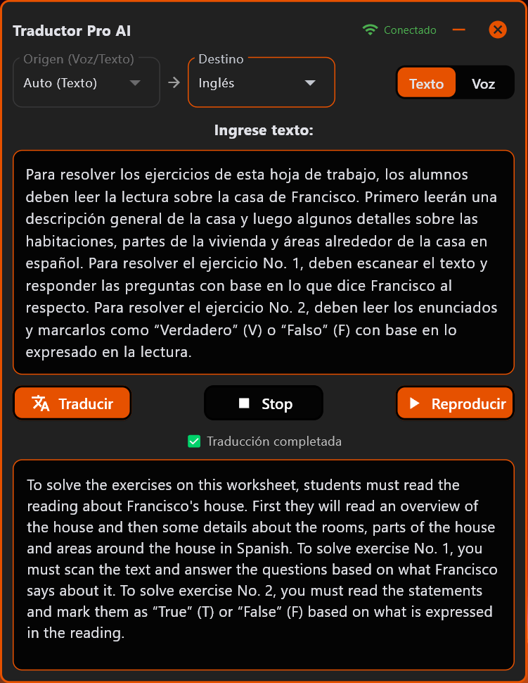
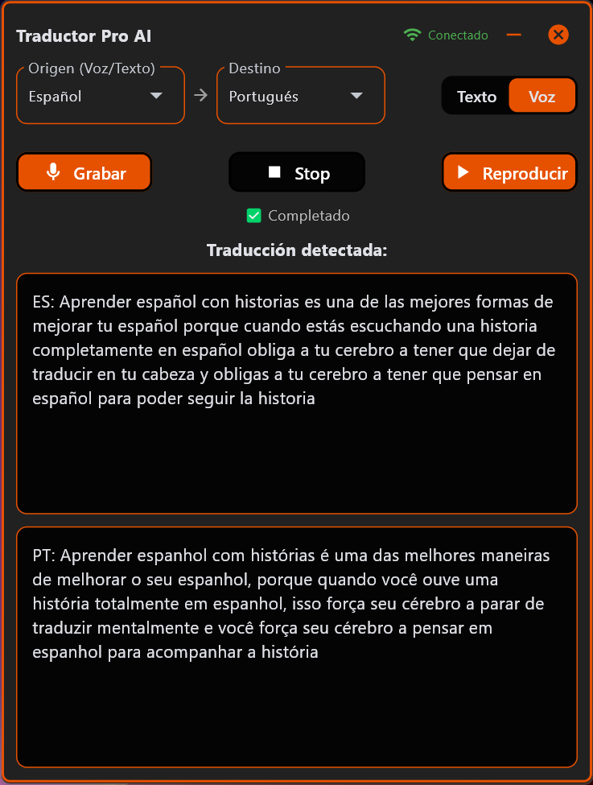

# Translator Pro AI
### Traductor de texto y voz con síntesis de audio · Python & Flet · v1.0.0

Aplicación de escritorio con interfaz gráfica frameless y tema oscuro para traducir texto
escrito y voz en tiempo real. Integra reconocimiento de voz, síntesis TTS y traducción
automática vía Google, con cache LRU para optimizar el uso de la API.

---

## Capturas de Pantalla

<p align="center">
  
  &nbsp;&nbsp;
  
</p>

---

## Características Principales

- **Traducción de texto** — Detección automática del idioma de origen con caché LRU integrado que evita llamadas repetidas a la API.
- **Traducción por voz** — Grabación desde micrófono (máx. 60 seg.) con preprocesamiento de audio: reducción de ruido espectral, filtro pasa-banda (60–7000 Hz) y normalización antes de enviar a Google Speech API.
- **Síntesis de voz (TTS)** — Reproduce la traducción con `gTTS` + `pygame`, con controles de pausar, reanudar y detener. Soporta textos largos mediante división inteligente por puntuación.
- **Monitor de conectividad** — Hilo en segundo plano que verifica la conexión cada 5 segundos y actualiza el indicador WiFi en la barra de título.
- **Interfaz frameless** — Ventana sin bordes (500×655), arrastrable, con modo oscuro y paleta naranja/gris.
- **Arquitectura de Producción (Windows)** — Integración nativa mediante AppUserModelID para gestión correcta en la barra de tareas y manejo dinámico de certificados SSL para garantizar conectividad segura en entornos compilados (.exe).
- **Log de errores** — Registro automático en app.log con gestión de tamaño (máx. 5MB) y rotación de archivos para optimizar el almacenamiento del usuario.

---

## Arquitectura

```
├── config/
│   └── settings.py        # Título, versión, app ID y diccionario de idiomas (10 idiomas)
├── core/
│   ├── traduccion.py      # Motor de traducción (GoogleTranslator + cache LRU + divisor de texto)
│   ├── audio.py           # Motor TTS: gTTS → BytesIO → pygame mixer (estados: playing/paused/stopped)
│   └── voz.py             # Motor STT: sounddevice → preprocesamiento → Google Speech API
├── ui/
│   └── vistas.py          # Todos los componentes Flet (layout, botones, dropdowns, estilos)
├── utils.py               # CacheTraduccion (LRU con OrderedDict) + GestorConectividad
├── main.py                # Orquestador: binding de eventos, hilos y lógica de la app
└── requirements.txt
```

---

## Idiomas Soportados

Español · Inglés · Francés · Portugués · Italiano · Alemán · Chino · Japonés · Coreano  
*(Detección automática disponible en modo texto)*

---

## Tecnologías

| Librería | Uso |
|---|---|
| `flet 0.28.3` | Interfaz gráfica de escritorio |
| `deep-translator` | Traducción vía Google Translate |
| `SpeechRecognition` | Transcripción de voz a texto (Google Speech API) |
| `gTTS` | Síntesis de voz (Text-to-Speech) |
| `pygame` | Reproducción y control del mixer de audio |
| `sounddevice` | Captura de audio desde micrófono |
| `noisereduce` + `scipy` | Preprocesamiento y limpieza de audio |
| `certifi` | Manejo de certificados SSL en ejecutables compilados |

---

## Instalación

**Requisitos:** Python 3.10+ · Windows (recomendado) / Linux / macOS  
**Hardware:** Micrófono (modo voz) · Conexión a internet

```bash
# 1. Clonar el repositorio
git clone https://github.com/PabloSalinasDev/translator-pro-ai.git
cd translator-pro-ai

# 2. Crear entorno virtual (recomendado)
python -m venv .venv
source .venv/bin/activate      # Linux/Mac
venv\Scripts\activate         # Windows

# 3. Instalar dependencias
pip install -r requirements.txt

# 4. Ejecutar
python main.py
```

---

## Modos de Uso

**Modo Texto**
1. Seleccioná el idioma de destino (el origen se detecta automáticamente).
2. Escribí el texto en el campo de entrada.
3. Presioná **Traducir** → el resultado aparece en pantalla.
4. Opcionalmente, presioná **Reproducir** para escuchar la traducción.

**Modo Voz**
1. Seleccioná el idioma de origen y de destino *(no usar "Auto" en modo voz)*.
2. Presioná **Grabar** → hablá al micrófono (máx. 60 segundos, con contador regresivo).
3. Presioná **Stop rec** → el sistema transcribe y traduce automáticamente.
4. El texto original y la traducción aparecen en pantalla; presioná **Reproducir** para escucharla.

---

## Aprendizajes Técnicos

- Arquitectura multihilo con `threading` para no bloquear la UI durante grabación, TTS, y monitoreo de red.
- Máquina de estados para el reproductor de audio: `playing → paused → stopped`.
- Cache LRU implementado manualmente con `OrderedDict` (sin librerías externas).
- Preprocesamiento de señal de audio: reducción de ruido espectral con `noisereduce` y filtro Butterworth pasa-banda con `scipy.signal`.
- División inteligente de texto largo con `re` y `textwrap` para no exceder límites de la API TTS.
- Manejo de SSL con `certifi` para compatibilidad en ejecutables generados con PyInstaller.
- Pantalla de carga con verificación de conectividad antes de habilitar la interfaz principal.

---

*Desarrollado por [Pablo Salinas](https://github.com/PabloSalinasDev)*